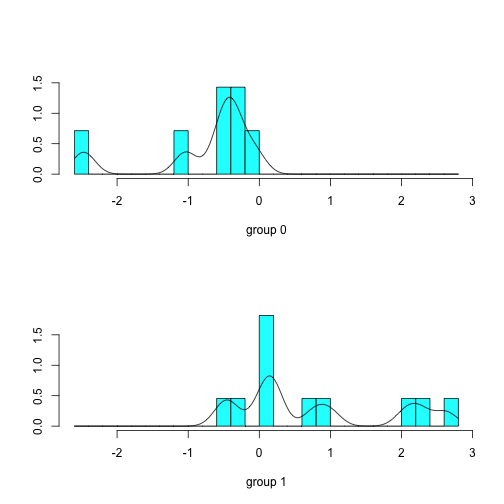

LA BLACK LIST DELLA CONSOB. CRISI FINANZIARIE E OBBLIGHI INFORMATIVI PER LE SOCIETÀ QUOTATE
========================================================
A. Danovi, S. Olgiati, A. Morlin Visconti 
--------------------------------------------------------


```r
library(MASS)
library(lattice)
library(RCurl)
```

```
## Loading required package: bitops
```


```r
raw.data = read.csv("/Users/stefanoolgiati/Desktop/BlackList/blacklist.csv")
names(raw.data)
```

```
## [1] "ENTITY"    "IN"        "OUT"       "CAUSE_OUT" "BIN"       "SECTOR"   
## [7] "EMP"       "REV"       "CAP"
```

```r
dim(raw.data)
```

```
## [1] 95  9
```


```r
attach(raw.data)
summary(na.omit(EMP))
```

```
##    Min. 1st Qu.  Median    Mean 3rd Qu.    Max. 
##       2     106     316    1140     875   19000
```

```r
cv.EMP <- sd(na.omit(EMP))/mean(na.omit(EMP))
cv.EMP
```

```
## [1] 2.428
```

```r
summary(na.omit(REV))
```

```
##    Min. 1st Qu.  Median    Mean 3rd Qu.    Max. 
##       0      25      80     285     240    3200
```

```r
cv.REV <- sd(na.omit(REV))/mean(na.omit(REV))
cv.REV
```

```
## [1] 1.924
```

```r
summary(na.omit(CAP))
```

```
##    Min. 1st Qu.  Median    Mean 3rd Qu.    Max. 
##     4.0    15.0    20.0    61.5    45.0   600.0
```

```r
cv.CAP <- sd(na.omit(CAP))/mean(na.omit(CAP))
cv.CAP
```

```
## [1] 1.799
```


```r
clean.data <- na.omit(raw.data)
dim(clean.data)
```

```
## [1] 18  9
```

```r
summary(clean.data)
```

```
##                      ENTITY         IN                        OUT   
##  A.S. Roma              : 1   Apr-08 :2   Aug-09                :5  
##  Chl                    : 1   Aug-09 :2   Jun-07                :2  
##  Ciccolella             : 1   Nov-02 :2   ago-09  ; ancora in bl:1  
##  Data Service (BEE Team): 1   Apr-03 :1   Apr-04                :1  
##  Fullsix                : 1   Feb-05 :1   Jan-08                :1  
##  Garboli Conicos        : 1   Jan-06 :1   Jan-12                :1  
##  (Other)                :12   (Other):9   (Other)               :7  
##                                    CAUSE_OUT      BIN       
##  miglioramento posiz patrim             :8   Min.   :0.000  
##  fallimento                             :2   1st Qu.:0.000  
##  14 giugno 10, procedimento fallimentare:1   Median :1.000  
##  15 ottobre 2009, opa totalitaria       :1   Mean   :0.611  
##  19 aprile 2004, fallimento societ<e0>  :1   3rd Qu.:1.000  
##  21 maggio 04, amministrazione straord  :1   Max.   :1.000  
##  (Other)                                :4                  
##                                 SECTOR        EMP            REV       
##  calcio                            : 2   Min.   :   2   Min.   :  0.0  
##  information tecnology             : 2   1st Qu.: 150   1st Qu.: 27.8  
##  ceramica                          : 1   Median : 200   Median : 83.5  
##  commercio elettronico             : 1   Mean   : 588   Mean   :174.2  
##  costruzione e vendita di ascensori: 1   3rd Qu.: 717   3rd Qu.:250.0  
##  energie rinnovabili               : 1   Max.   :2600   Max.   :700.0  
##  (Other)                           :10                                 
##       CAP       
##  Min.   :  8.0  
##  1st Qu.: 16.2  
##  Median : 28.5  
##  Mean   : 37.8  
##  3rd Qu.: 50.0  
##  Max.   :110.0  
## 
```


```r
scaled.data <- scale(clean.data[, -1:-6])
scaled.data
```

```
##        EMP     REV      CAP
## 2  -0.6749 -0.2691 -0.95745
## 6  -0.5819 -0.4826  0.07660
## 9  -0.5154  1.6815  2.48937
## 11 -0.6085 -0.7407 -0.95745
## 14  1.8768  0.6839  0.42128
## 15 -0.5819 -0.1699  1.45532
## 27 -0.3161 -0.7407 -0.61277
## 30  2.6742  2.6097 -0.09574
## 32  0.6142  0.3761  0.42128
## 34  1.3452  1.3688  1.11064
## 36  0.1491 -0.5173 -0.61277
## 38 -0.5819 -0.6166  1.11064
## 48 -0.7786 -0.8648 -0.78511
## 50 -0.7374 -0.8002  0.07660
## 54 -0.5154 -0.7903 -0.54383
## 67 -0.3918  0.3761 -1.02639
## 70  0.1796 -0.4180 -0.61277
## 77 -0.5553 -0.6861 -0.95745
## attr(,"scaled:center")
##    EMP    REV    CAP 
## 587.83 174.22  37.78 
## attr(,"scaled:scale")
##    EMP    REV    CAP 
## 752.43 201.47  29.01
```

```r
class(scaled.data)
```

```
## [1] "matrix"
```

```r
scaled.data.frame <- as.data.frame(scaled.data)
class(scaled.data.frame)
```

```
## [1] "data.frame"
```

```r
scaled.data.frame
```

```
##        EMP     REV      CAP
## 2  -0.6749 -0.2691 -0.95745
## 6  -0.5819 -0.4826  0.07660
## 9  -0.5154  1.6815  2.48937
## 11 -0.6085 -0.7407 -0.95745
## 14  1.8768  0.6839  0.42128
## 15 -0.5819 -0.1699  1.45532
## 27 -0.3161 -0.7407 -0.61277
## 30  2.6742  2.6097 -0.09574
## 32  0.6142  0.3761  0.42128
## 34  1.3452  1.3688  1.11064
## 36  0.1491 -0.5173 -0.61277
## 38 -0.5819 -0.6166  1.11064
## 48 -0.7786 -0.8648 -0.78511
## 50 -0.7374 -0.8002  0.07660
## 54 -0.5154 -0.7903 -0.54383
## 67 -0.3918  0.3761 -1.02639
## 70  0.1796 -0.4180 -0.61277
## 77 -0.5553 -0.6861 -0.95745
```

```r
input.data <- data.frame(BIN = na.omit(clean.data$BIN), scaled.data.frame)
input.data
```

```
##    BIN     EMP     REV      CAP
## 2    1 -0.6749 -0.2691 -0.95745
## 6    1 -0.5819 -0.4826  0.07660
## 9    1 -0.5154  1.6815  2.48937
## 11   0 -0.6085 -0.7407 -0.95745
## 14   0  1.8768  0.6839  0.42128
## 15   1 -0.5819 -0.1699  1.45532
## 27   0 -0.3161 -0.7407 -0.61277
## 30   0  2.6742  2.6097 -0.09574
## 32   1  0.6142  0.3761  0.42128
## 34   1  1.3452  1.3688  1.11064
## 36   1  0.1491 -0.5173 -0.61277
## 38   1 -0.5819 -0.6166  1.11064
## 48   1 -0.7786 -0.8648 -0.78511
## 50   1 -0.7374 -0.8002  0.07660
## 54   1 -0.5154 -0.7903 -0.54383
## 67   0 -0.3918  0.3761 -1.02639
## 70   0  0.1796 -0.4180 -0.61277
## 77   0 -0.5553 -0.6861 -0.95745
```


```r
attach(input.data)
```

```
## The following objects are masked from raw.data:
## 
##     BIN, CAP, EMP, REV
```

```r
cor(input.data[, -1])
```

```
##        EMP    REV    CAP
## EMP 1.0000 0.7544 0.1445
## REV 0.7544 1.0000 0.4851
## CAP 0.1445 0.4851 1.0000
```

```r
par(mfrow = (c(1, 3)))
qqnorm(CAP, main = "Capitalizzazione", xlab = NA)
qqline(CAP, col = 2)
qqnorm(REV, main = "Ricavi", ylab = NA)
qqline(REV, col = 2)
qqnorm(EMP, main = "Organico", xlab = NA, ylab = NA)
qqline(EMP, col = 2)
```

 


```r
attach(clean.data)
```

```
## The following objects are masked from input.data:
## 
##     BIN, CAP, EMP, REV
## The following objects are masked from raw.data:
## 
##     BIN, CAP, CAUSE_OUT, EMP, ENTITY, IN, OUT, REV, SECTOR
```

```r
lda.fit <- lda(BIN ~ EMP + REV + CAP, data = clean.data)
lda.fit
```

```
## Call:
## lda(BIN ~ EMP + REV + CAP, data = clean.data)
## 
## Prior probabilities of groups:
##      0      1 
## 0.3889 0.6111 
## 
## Group means:
##     EMP   REV   CAP
## 0 895.1 205.4 21.86
## 1 392.3 154.4 47.91
## 
## Coefficients of linear discriminants:
##            LD1
## EMP -0.0006589
## REV -0.0022781
## CAP  0.0411477
```

```r
plot(lda.fit, dimen = 1, type = "both")
```

 


```r
lda.pred <- predict(lda.fit, clean.data)
names(lda.pred)
```

```
## [1] "class"     "posterior" "x"
```

```r
lda.class <- lda.pred$class
table(lda.class, BIN)
```

```
##          BIN
## lda.class 0 1
##         0 6 2
##         1 1 9
```

```r
mean(lda.class == BIN)
```

```
## [1] 0.8333
```

